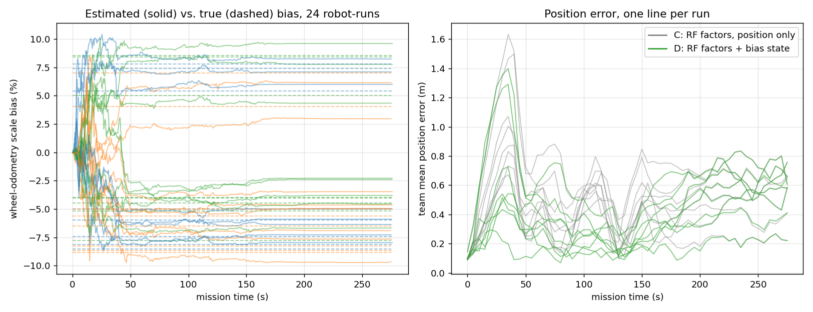

# meshbots — the mesh is also a sensor

**Opportunistic communication-as-sensing for an infrastructure-free robot
team.** Three simulated rovers run a delivery mission with no central
coordinator, routing their own ad-hoc mesh. Every packet they relay arrives
with a measured signal strength — and this project turns that free
by-product into localization, mapping, and **online calibration of the
robots' own wheel odometry**.

ROS 2 Jazzy · Gazebo Harmonic · Python. MIT. Built in the open, budget $0.

<p align="center">
  
</p>

## Results (Campaign 3, 8 seeded missions, all 3/3 deliveries)

Four localization tracks run **simultaneously in every mission on identical
noisy odometry and identical packets**, so every run is its own paired
ablation:

| track | estimator | uses the mesh? | team ATE |
|---|---|---|---|
| A | pure dead reckoning | no | 1.99 ± 0.29 m |
| B | compass-aided dead reckoning | no — *the baseline* | 0.97 ± 0.12 m |
| C | B + RSSI range factors (peers + pad tags) | **yes** | 0.57 ± 0.12 m |
| **D** | C + wheel-scale bias as an EKF state | **yes** | **0.46 ± 0.12 m** |

| paired per seed | ATE reduction | better in |
|---|---|---|
| C vs B — range factors from mission traffic | 41% ± 13% | 8/8 |
| D vs C — the bias state alone | 20% ± 8% | 8/8 |
| D vs B — the whole communication-as-sensing layer | 52% ± 15% | 8/8 |

**Self-calibration:** each rover carries a hidden 4–9% velocity-scale bias
(random sign). After one mission the estimate is within **1.1% ± 0.5%** of
the truth (24 robot-runs) — observed purely through the RSSI of packets
the team was exchanging anyway. Map coverage: 95% merged vs 87% own lidar;
≈8,400 packets relayed hop-by-hop per mission.

**Formation as aperture (Campaign 2):** letting followers perturb their
formation slots to make their links informative harvested *more* RF
information (median paired correction 44% vs 36%) but the extra
manoeuvring cost as much odometry drift as it bought, and cost mission
time. Reported as a negative result with its mechanism (§4.1 of the paper):
information-gain planning amplifies estimator inconsistency.

Full tables, per-seed numbers and caveats: [`docs/RESULTS.md`](docs/RESULTS.md).
Raw logs of every run: [`results/`](results/). Paper draft:
[`docs/PAPER.md`](docs/PAPER.md). One-page idea: [`docs/IDEA.md`](docs/IDEA.md).
Literature and honest novelty statement: [`docs/RELATED.md`](docs/RELATED.md).

> **Caveat that matters:** the headline point uses an idealized channel
> (log-distance path loss, 2 dB i.i.d. shadowing). Real indoor WiFi shows
> 3–6 dB plus multipath and per-device offsets. A channel-harshness sweep
> (2/4/6/8 dB, correlated fading, unknown offsets) is Campaign 4 and will
> be reported here whether or not the gains survive.

## What the system does

- **Mesh** — every rover is a network node. Packets flood hop-by-hop (TTL +
  duplicate suppression, MANET-style); two rovers out of radio range talk
  *through* the third. No base station.
- **Cooperative localization from traffic** — odometry is deliberately
  degraded (bias + noise, seeded per robot). Each rover corrects itself with
  range factors inverted from the RSSI of the *direct* packets it hears —
  from teammates (whose broadcast poses carry covariance) and from cheap
  transmit-only RF tags on the delivery pads. Links whose ray crosses a
  known obstacle are gated out: lidar informing RF.
- **The mesh calibrates the wheels** — the wheel-odometry scale bias is an
  EKF state; the range factors observe it through the motion model.
- **Collaborative mapping** — each rover shares only changed cells ("map
  patches") **exclusively over the mesh**; peers merge them. Partition the
  mesh and the maps visibly stop converging.
- **RF-shadow mapping** — a link that loses more signal than free space
  predicts means *something stands between the robots*; the excess votes
  obstruction along the ray into cells no lidar has seen: RF informing the
  map.
- **Squadron behaviour** — heartbeat leader election with failover, wedge
  formation from the leader's *mesh-beaconed* estimate, sealed-bid delivery
  auctions with load balancing, a mission FSM replicated on every robot.
- **Formation-as-aperture planner** (optional arm) — followers score
  perturbations of their slot by predicted link information (range-factor
  variance reduction + unknown map cells the link would sweep) minus
  deviation and motion cost, under a leader-link PDR floor.

Everything per-robot is identical code under its own namespace. The only
global process is the RF propagation simulator, which models physics
(path loss, penetration, fading, packet loss, per-packet RSSI stamping) —
never coordination. Robots never see ground truth.

## Quick start

```bash
sudo apt install ros-jazzy-desktop ros-jazzy-ros-gz        # Jazzy + Gazebo Harmonic
cd ros2_ws && colcon build --symlink-install && source install/setup.bash
ros2 launch meshbots sim.launch.py                          # Gazebo GUI + RViz
ros2 launch meshbots sim.launch.py gui:=false rviz:=false   # headless
```

The mission runs itself: form up, sweep to each red pad, auction the
delivery, the winner docks (the pad's own RF chirp is the docking sensor),
the pad turns green, return to base. ~2 minutes to complete; runs are
evaluated over a 280 s window.

Launch arguments:

| arg | values | meaning |
|---|---|---|
| `seed` | int | reproducible odometry-degradation and channel draws |
| `formation` | `fixed` · `informative` · `aware` | wedge only · aperture planner · cost-aware aperture planner |
| `rf_sigma_db` / `rf_fading_db` / `rf_fading_tau` / `rf_offset_db` | floats | channel harshness (defaults = idealized channel) |
| `chassis` | `builtin` · `rosbot` | simple diff-drive rover · Husarion ROSbot stack (scaffolded, untested) |
| `eval_dir` | path | where per-run CSV logs go |

## Reproduce the numbers

```bash
./scripts/run_batch.sh 8 results/my_fixed 280                          # 8 seeds, ~40 min
./scripts/run_batch.sh 8 results/my_aware 280 formation:=aware         # a paired arm
ros2 run meshbots batch_metrics --dir results/my_fixed --markdown --plot out.png
ros2 run meshbots batch_metrics --compare results/my_fixed results/my_aware
python3 scripts/plot_bias.py results/my_fixed bias.png
```

Every campaign in `docs/RESULTS.md` was produced exactly this way
(`scripts/run_campaign3.sh`, `scripts/run_sensitivity.sh`), and the raw
per-run CSVs are committed under `results/`. If track D doesn't beat C, or
C doesn't beat B, the claim is falsified — that is the point of the
protocol.

## Project layout

```
ros2_ws/src/meshbots/
├── meshbots/
│   ├── mesh_radio.py         # MANET flooding relay (per robot)
│   ├── radio_channel.py      # the ONLY global node: RF physics, "the air"
│   ├── rf_model.py           # shared path-loss model (mirrors arena.sdf)
│   ├── localizer.py          # 4-track localizer: DR / compass DR / RF EKF / + bias state
│   ├── mapper.py             # collaborative grid + RF-shadow layer
│   ├── swarm.py              # election · formation · auctions · mission FSM
│   ├── formation_planner.py  # formation-as-aperture slot perturbation
│   ├── navigator.py          # potential-field local planner
│   ├── eval_metrics.py       # single-run ATE
│   └── batch_metrics.py      # campaign statistics, paired comparisons, plots
├── launch/  sim.launch.py · gazebo.launch.py · rviz.launch.py
├── config/  team · swarm · localization · mapping · navigation · mesh · formation(_aware)
├── worlds/arena.sdf · models/rover.sdf.template · missions/delivery.yaml
scripts/     run_batch.sh · run_campaign3.sh · run_sensitivity.sh · plot_bias.py
docs/        RESULTS.md · PAPER.md · IDEA.md · RELATED.md · figures
results/     raw per-run logs of every reported campaign
```

Structured after the Husarion ROS 2 tutorial conventions: one package,
small composable launch files, every tunable in `config/*.yaml`. Adding a
fourth rover is one line in `team.yaml` plus a slot in `swarm.yaml`.

## Architecture

```
                 ┌────────────────────────── per rover ×3 ──────────────────────────┐
                 │                                                                  │
  Gazebo         │  scan ──► mapper ◄── /pose ── localizer ◄── odom (degraded DR)   │
  (arena,        │            │  ▲ map patches      ▲  RSSI range factors           │
  diff-drive,    │            │  └──────┐           │  + bias state, RF-shadow rays │
  gpu lidar)     │            ▼         │           │                               │
                 │       merged_map   mesh/rx ◄── mesh_radio ◄─┐ (flood relay,      │
                 │            ▲          ▲            ▲        │  TTL, dedup)       │
                 │  formation_planner ─► swarm ── beacons ─────┘                    │
                 │   (slot_offset)        │ election · formation · auction          │
                 │                        ▼                                         │
                 │  goal ──► navigator ──► cmd_vel                                  │
                 └──────────────────────────────────────────────┼───────────────────┘
                                                                │ air_tx / air_rx
                                               radio_channel  ◄─┘
                              (RF physics only: log-distance path loss, obstacle
                               penetration, shadowing/fading/offsets, PDR,
                               per-packet RSSI stamping, delivery-pad tag chirps)
```

## What to watch in RViz

- **Green↔red lines** between rovers: live mesh links coloured by predicted
  packet-delivery ratio. Watch one redden as a silo slides between rovers.
- **Merged map** (`/rover_1/merged_map`): mid-gray cells (value 60) are
  RF-suspected obstacles no lidar has confirmed; raw evidence in `rf_map`.
- **Labels** over each rover: role and mission phase. Red pads pending,
  green delivered.

## Honest limitations

- **Sim-only, idealized RF** at the headline point (see caveat above).
  Hardware validation (ESP32 RSSI is near-free) is the necessary next step.
- **Channel parameters assumed known** (P_tx, PL_0, n); field deployment
  needs online range-model calibration.
- **Correlated estimates**: peer range updates ignore cross-correlation
  (classic cooperative-localization consistency issue); we use inflation +
  a covariance floor, which also pins the covariance and starved the
  formation planner of a geometry signal. Covariance intersection is the
  proper fix and is queued.
- **Shared map origin** (surveyed base); real C-SLAM earns the transform
  via inter-robot loop closures.
- **Greedy per-robot planning**, one-step lookahead; **n = 8 per arm**;
  one arena, three robots. Statistics are indicative.

## Cite

```
Ziadeh, M. (2026). The Mesh Calibrates the Wheels: Opportunistic
Communication-as-Sensing for Infrastructure-Free Robot Teams.
Working draft, https://github.com/MazharZiadeh/meshbots
```
