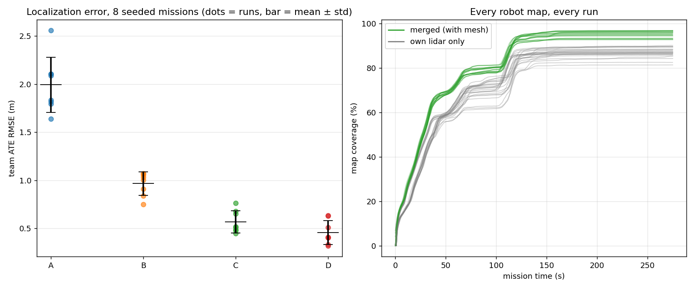
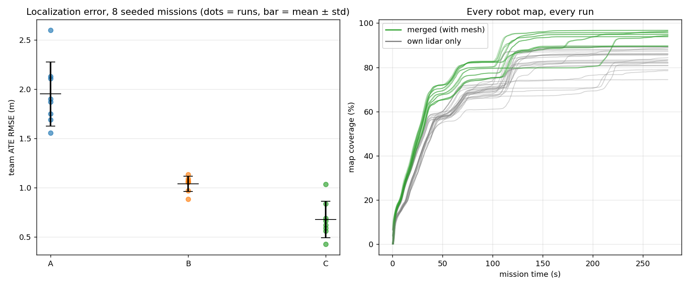

# Monte Carlo evaluation

All raw per-run logs live under `results/<campaign>/run_<seed>/` in this
repository; every number below regenerates with
`ros2 run meshbots batch_metrics --dir results/<campaign> --markdown`.

## Campaign 3 — the mesh calibrates the wheels (8 missions, seeds 1–8, fixed wedge)

Same protocol as Campaign 1, but the localizer now runs **four** tracks on
identical noisy odometry and identical accepted range factors:

- **A** pure dead reckoning · **B** compass DR (no RF, the baseline) ·
  **C** B + RSSI range factors (position-only fusion, the Campaign-1/2
  system) · **D** C + the wheel-odometry **scale bias as an EKF state**,
  observed through the motion model by the same range factors. Track D
  drives the robot.

**Mission success:** 8/8 runs delivered all 3 targets (median completion
128 s).

| track | team ATE mean | std | min | max |
|---|---|---|---|---|
| A pure dead reckoning | 1.99 m | 0.29 | 1.64 | 2.56 |
| B compass DR (no RF) | 0.97 m | 0.12 | 0.75 | 1.07 |
| C + RF range factors | 0.57 m | 0.12 | 0.45 | 0.76 |
| **D + RF + bias state** | **0.46 m** | 0.12 | 0.32 | 0.63 |

Paired per seed (same odometry draw, same packets):

| comparison | ATE reduction | median | better in |
|---|---|---|---|
| C vs B — RF factors vs no RF | 41% ± 13% | 44% | 8/8 |
| **D vs B — RF + bias state vs no RF** | **52% ± 15%** | 56% | 8/8 |
| **D vs C — the bias state alone** | **20% ± 8%** | 21% | **8/8** |

**Self-calibration:** the injected scale bias averages 6.5% in magnitude
(range 4–9%, random sign); after one mission the residual is
**1.1% ± 0.5%** over 24 robot-runs — from packet RSSI alone, no encoder
calibration, no external positioning. Convergence takes ~50 s of motion
(figure below). Coverage 95% merged vs 87% own lidar; ≈8,400 packets
relayed per mission.

Per-seed team ATE (B / C / D, m): 1.03/0.49/0.32 · 1.10/0.78/0.64 ·
1.09/0.54/0.42 · 0.92/0.46/0.34 · 1.04/0.66/0.52 · 0.77/0.49/0.41 ·
1.10/0.52/0.41 · 0.87/0.69/0.63.

**Read honestly:** the gain from the bias state is consistent (8/8) and
moderate (one fifth of the remaining error), not dramatic; the residual
error is now dominated by things a scale state cannot fix (range noise,
peer correlation, the parked tail). The remarkable part is the
calibration itself: a 6.5% wheel-scale error recovered to ~1% by a sensor
the robot was not carrying for that purpose. The formation arms of this
campaign (cost-aware and original informative planner, same seeds, same
estimator) are reported below as they complete.

## Campaign 2 — Formation-as-Aperture paired A/B (8 + 8 missions, seeds 1–8)

Same-seed arms on identical code: fixed wedge vs. informative formation
perturbation (`formation:=informative`, trust radius 2.2 m).

| metric | fixed wedge | informative | informative better |
|---|---|---|---|
| fused ATE (team mean) | 0.69 m | 0.66 m | 5/8 runs |
| RF paired improvement (C vs B) | median 36%, 7/8 runs | **median 44%, 8/8 runs** | — |
| merged-map coverage | 95.0% | 94.1% | 4/8 runs |
| mission time (completed runs) | 127.5 s | 130.2 s | 0/5 runs |
| missions 3/3 in window | 7/8 | 5/8 | — |

**Verdict, stated plainly:** at this operating point the planner is *not* a
net win. It demonstrably harvests more RF information — its arm shows the
strongest RF correction of any campaign (median 44%, positive in all 8
runs, minimum +6%) — but the extra maneuvering raises dead-reckoning error
(pure-DR 2.16 m vs 1.86 m on identical seeds: more turning, more noise
integrated) and costs mission-window completions. The harvested information
roughly pays for the motion it induces, and no more. The mechanism works;
the price is mispriced. Next experiment: sweep the trust radius / deviation
cost to trace the mission-time-vs-information Pareto front — the harness
makes each point one command.

A secondary finding from the first (aborted) A/B attempt is documented in
the paper draft §4.1: the planner amplified a filter-consistency flaw
(correlated peer updates → overconfidence → locked-in bias → delivery
docking livelock), fixed by covariance safeguards plus using the delivery
pad's chirp as a physical docking sensor.

---

## Campaign 1 — RF range factors (8 missions, seeds 1–8)

**Protocol.** Each run is a complete delivery mission (3 pads, wedge formation,
distributed auctions) in the 30×30 m arena, with a fixed **280 s wall window**
at real-time factor 1. Per run, the odometry degradation of every rover is
drawn from a seeded RNG (`seed:=N`, reproducible per `(robot, seed)` pair);
RF shadowing and packet loss are stochastic per packet. All three localization
tracks run *simultaneously on identical noisy odometry inside the same
mission*, so the RF-vs-no-RF comparison is paired by construction:

- **A — pure dead reckoning:** integrate noisy (v, ω) only.
- **B — compass-aided DR:** noisy v + magnetometer yaw. *The no-RF baseline.*
- **C — B + RF range factors:** EKF updates from the RSSI of direct mesh
  packets (peer broadcasts + delivery-pad tags). *The system.*

Reproduce with `./scripts/run_batch.sh 8` then
`ros2 run meshbots batch_metrics --dir /tmp/meshbots_batch --markdown`.

## Mission success

**7/8 runs delivered all 3 targets** within the window. The single miss
(seed 4) was a time truncation, not a coordination failure: the squadron had
delivered pads A and B and was ~5 m from pad C when the 280 s window closed
(harsher noise draw → slower legs). No run showed an auction deadlock,
election failure, or collision.

## Localization: absolute trajectory error (team mean per run)

| track | ATE mean | std | min | max |
|---|---|---|---|---|
| A — pure dead reckoning | 1.95 m | 0.33 | 1.56 | 2.60 |
| B — compass DR (no RF) | 1.04 m | 0.08 | 0.88 | 1.13 |
| **C — + RF range factors** | **0.68 m** | 0.18 | 0.43 | 1.03 |

**Paired per-seed comparison (C vs B): 34% ± 19% ATE reduction, better in
8 of 8 runs.** The ranging signal costs zero additional hardware — it is the
RSSI of packets the mesh was already exchanging for maps, beacons, and bids.

## Collaborative mapping

End-of-mission occupancy coverage, mean per robot: **94% with mesh-merged
patches vs 84% from a robot's own lidar alone** (+10 points from teammates).
The gain is deliberately modest: the squadron travels in formation, so
viewpoints correlate. Dispersed exploration would widen it — that is a
mission-design choice, not a mapping limitation.

## Mesh traffic

Per mission (team totals, mean): **≈4,200 packets originated, ≈9,000
received, ≈8,400 relayed hop-by-hop.** Every relayed packet is a rover
acting as network infrastructure; the `path` field in any received packet
records the actual route taken.

## Caveats

- The RF model is idealized (log-distance + penetration, i.i.d. shadowing;
  no multipath or antenna patterns). Numbers here validate the *architecture*,
  not any specific radio hardware.
- ATE is computed over the full window including the parked tail after
  mission completion.
- Peer-to-peer range updates ignore estimate cross-correlation (classic
  cooperative-localization consistency issue); pad anchors bound the effect.
- n=8; std values are indicative, not publication-grade confidence intervals.
  The harness makes larger n a one-line change.
